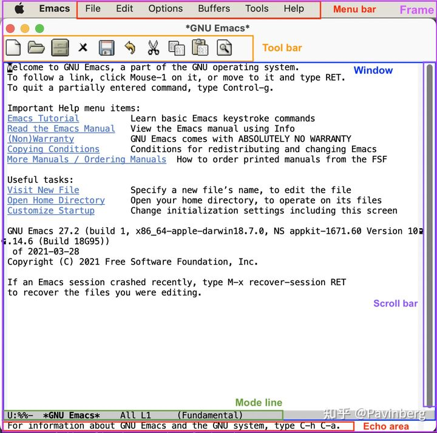
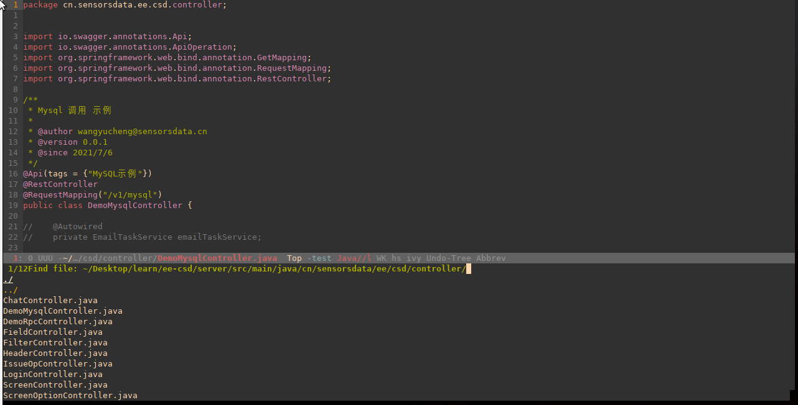
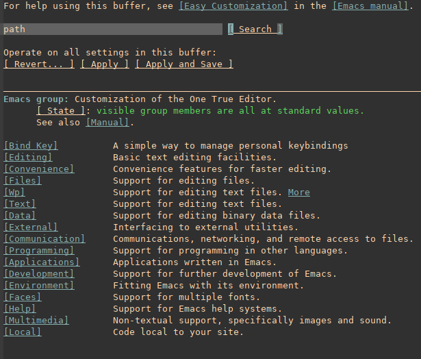

##### 参考

```
https://github.com/cabins/.emacs.d


Emacs高手修炼手册: 
https://www.jianshu.com/p/42ef1b18d959

插件整理
https://www.zhihu.com/question/21943533
https://zhuanlan.zhihu.com/p/441612281
https://www.zhangjiee.com/topic/emacs/package.html


推荐1
https://huadeyu.tech/tools/emacs-setup-notes.html#orga1adbf9
```


[emacs wiki](https://www.emacswiki.org)

[中文论坛](https://emacs-china.org/)

[插件作者 abo-abo ](https://github.com/abo-abo)

# 安装

> [官网](http://www.gnu.org/software/emacs/emacs.html)
>
> version 27.2
>
> [下载地址](http://ftp.gnu.org/gnu/emacs/)

##### install - centos

```bash
$ dnf install emacs
$ dnf remove emacs

安装编译的依赖
$ dnf install gnutls-devel make gcc clang ncurses-devel 
$ wget https://mirrors.nju.edu.cn/gnu/emacs/emacs-27.2.tar.xz
$ xz -d emacs-27.2.tar.xz
$ tar xvf emacs-27.2.tar

$ ./configure --prefix=/opt/emacs (不用这个)
$ ./configure --prefix=/opt/emacs --without-x (用这个)

$ make
$ make install
$ ln -s /opt/emacs/bin/emacs /usr/bin/emacs
```

##### install - ubuntu

```
$ apt-get install emacs
$ apt-get remove emacs

安装编译的依赖
$ apt-get install libgtk2.0-dev libxpm-dev libjpeg-dev libgif-dev libtiff-dev libgnutls28-dev libncurses-dev
$ ./configure --prefix=/opt/emacs
$ make
$ make install
$ ln -s /opt/emacs/bin/emacs /usr/bin/emacs
```

##### 运行

```bash
$ emacs -nw
$ emacs
```

# 概念

##### 功能区



- Frame: 如果用图形界面打开 Emacs 程序，那么一整个程序窗口被称为 Frame
- Menu bar: 即菜单栏，在 Frame 的最上方
- Tool bar: 即工具栏
- Echo Area: 回显区, 整个界面下方的一行
- Window: Tool bar 以下, Echo area 以上这一整个区域
- Mode line: 模式行, Window 最下方,Echo Area 上方
- Scroll bar: 图形界面时 Window 的最右侧滚动条
- Cursor: 光标
- Point: 光标所在的位置称为 Point. 光标有且只有一个，但 Point 是针对 Buffer 的，每个 Buffer 都有一个 Point

##### buffer

```
```

##### mini-buffer

最下面的框, 并不是全屏的




##### mode

- 主模式

  ```
  一个 Buffer 只能对应一个主模式
  最基本的主模式是 Fundamental mode, 没有进行任何配置的模式 
  主模式默认根据 Buffer 的文件类型来选择, 例如
      打开 .cpp 文件, buffer 自动设置成 c++-mode
      打开 .py 文件，buffer 自动设置为 python-mode
  
  
  手动切换
  	M-x 输入模式名
  ```

- 次模式

  ```
  同一个 Buffer 可以有多个次模式
  ```

##### mode hook

```
1. Mode hook 的作用就是当启动一个主模式时，自动执行一些已经“挂钩”到这个主模式的函数或次模式, 可以自由地向一个主模式上挂上各种功能，在启动这个主模式时就可以自动跟随着一起启动。

2. 主模式名-hook

主模式“文本文件模式” text-mode 时启动次模式“检查拼写” flyspell-mode
	(add-hook 'text-mode-hook 'flyspell-mode)

编程模式 prog-mode 启动时, 添加代码块折叠功能
	(add-hook 'prog-mode-hook #'hs-minor-mode)
```

##### melpa

Emacs 插件都放在了一些固定的仓库网站上, 最大的插件仓库就是 MELPA, 还有默认库 GNU ELPA

默认插件安装到 `~/.emacs.d/elpa/` 

- 添加代码库

  ```
  ; 把仓库地址 https://melpa.org/packages/ 存储到 package-archives 列表中，并命名为 melpa
  (require 'package)
  (add-to-list 'package-archives '("melpa" . "https://melpa.org/packages/") t)
  (package-initialize)
  ```

- 设置代理

  ```
    (setq gnutls-algorithm-priority "NORMAL:-VERS-TLS1.3") ; 不加这一句可能有问题，建议读者尝试一下
    (setq url-proxy-services '(("no_proxy" . "^\\(192\\.168\\..*\\)")
                               ("http" . "<代理 IP>:<代理端口号>")
    			   ("https" . "<代理 IP>:<代理端口号>")))
  ```

- 命令

  ```
  package-list-packages	列出仓库中的所有插件
  package-install <插件名> 安装插件
  package-delete <插件名> 删除插件  
  ```

# 配置

> 使用语法 elisp

> 参考
>
> https://www.jianshu.com/p/e9f9a5df96c2
>
> https://www.scanbuf.net/post/manual/basic-config/
>
> 
>
> https://blog.csdn.net/neo_liukun/article/details/115189475?spm=1035.2023.3001.6557&utm_medium=distribute.pc_relevant_bbs_down.none-task-blog-2~default~OPENSEARCH~Rate-5.nonecase&depth_1-utm_source=distribute.pc_relevant_bbs_down.none-task-blog-2~default~OPENSEARCH~Rate-5.nonecase
>
> 
>
> https://www.cnblogs.com/eat-and-die/p/10309681.html !!!!!!!

##### 配置文件路径

```bash
~/.emacs
~/.emacs.el
~/.emacs.d/init.el
~/.config/emacs/init.el
```

##### 源分类

| 类型         | 说明                                                         |
| ------------ | ------------------------------------------------------------ |
| gnu          | 一般是必备的，其它的 elpa 中的包会依赖 gnu 中的包            |
| melpa        | 滚动升级，收录了的包的数量最大                               |
| melpa-stable | 依据源码的 Tag （Git）升级，数量比 melpa 少，因为很多包作者根本不打 Tag |
| org          | 仅仅为了 org-plus-contrib 这一个包，org 重度用户使用         |
| marmalade    | 似乎已经不维护了，个人不推荐                                 |

##### ~/.emacs.d 目录结构

```
~/.emacs.d/lisp
插件配置文件目录，配置文件命名格式为init-xxx.el
~/.emacs.d/site-lisp
放置无法从elpa或其它仓库获取的第三方插件，本目录及其子目录须在启动时添加到load-path
~/.emacs.d/init.el
初始化load-path，初始化elpa，加载各插件配置文件等


mkdir -p ~/.emacs.d/lisp
mkdir -p ~/.emacs.d/site-lisp
```

##### 配置文件分类

```
Emacs 还可以有一个默认的初始化文件 default.el ，位于 Emacs 的任何标准的 package 搜索目录下

Emacs 还有配置文件 (site-wide startup file)，称为 site-start.el ，也位于 Emacs 的任何标准的 package 搜索目录下

Emacs 加载 package 中的配置是优先加载 site-start.el , 最后加载 default.el
Emacs 启动时，可以使用 -q 或 –no-init-file 选项来阻止 Emacs 加载初始化文件

inhibit-default-init 设置为 t ，那么 Emacs 不会加载 default.el
可以使用 –no-site-file 来禁止 Emacs 加载 site-start.el 配置文件

early-init.el 特殊的初始化配置文件.该配置文件在初始化 package 系统和 GUI 之前加载。

```

##### ~/.emacs.d/early-init.el

> 最先执行的配置文件

```lisp
(push '(menu-bar-lines . 0) default-frame-alist) ; 隐藏菜单栏
(push '(tool-bar-lines . 0) default-frame-alist) ; 隐藏工具栏
(push '(vertical-scroll-bars) default-frame-alist) ; 隐藏滚动条
(setq inhibit-startup-screen t) ; 关闭启动界面
;(setq frame-inhibit-implied-resize t) ; 禁止改变 frame 大小
(setq display-line-numbers-type 'relative) ; 行号类型: relative(相对行号), visual, t
(setq make-backup-files nil)                 ; 关闭文件自动备份
(setq default-buffer-file-coding-system 'utf-8)
(setq gc-cons-threshold most-positive-fixnum) ; 设置垃圾回收阈值, 加速启动速度

(global-display-line-numbers-mode t) ; 显示行号
(electric-pair-mode t) ; 自动补全括号
(show-paren-mode t) ; 括号匹配高亮
(prefer-coding-system 'utf-8) ; 设置系统的编码
(set-default-coding-systems 'utf-8)
(set-terminal-coding-system 'utf-8)
(set-keyboard-coding-system 'utf-8)
(column-number-mode t)                       ; 在 Mode line 上显示列号
(global-auto-revert-mode t)                  ; 当另一程序修改了文件时，让 Emacs 及时刷新 Buffer
(delete-selection-mode t)                    ; 选中文本后输入文本会替换文本（更符合我们习惯了的其它编辑器的逻辑）
(savehist-mode 1)                            ; 打开 Buffer 历史记录保存

(add-hook 'prog-mode-hook #'show-paren-mode) ; 编程模式下，光标在括号上时高亮另一个括号
(add-hook 'prog-mode-hook #'hs-minor-mode)   ; 编程模式下，可以折叠代码块

```

##### ~/.emacs.d/init.el

> 配置文件入口

```lisp
(setq package-archives '( ; 添加源
    ("melpa" . "http://mirrors.tuna.tsinghua.edu.cn/elpa/melpa/")
    ("gnu" . "http://mirrors.tuna.tsinghua.edu.cn/elpa/gnu/")
    ("org" . "http://mirrors.tuna.tsinghua.edu.cn/elpa/org/"))
)


(setq package-check-signature nil) ; 签名校验
(require 'package) ; 初始化包管理器

(package-initialize)
(package-refresh-contents)
; (unless (bound-and-true-p package--initialized)
;     (package-initialize)
; )
; (unless package-archive-contents ; 刷新软件源
;     (package-refresh-contents)
; )


(unless (package-installed-p 'use-package) ; 使用 use-package 管理扩展
    (package-refresh-contents) 
    (package-install 'use-package)
)

(eval-and-compile ; use-package 全局设置
    (setq use-package-always-ensure t)
    (setq use-package-always-defer t)
    (setq use-package-always-demand nil) 
    (setq use-package-expand-minimally t) 
    (setq use-package-verbose t)
)

(require 'use-package)


(use-package gruvbox-theme ; 主题
    :init (load-theme 'gruvbox-dark-soft t)
)


(use-package smart-mode-line ; 底部状态栏
    :init 
    (setq sml/no-confirm-load-theme t) 
    (setq sml/theme 'respectful) 
    (sml/setup)
)


(use-package benchmark-init ; 测试启动耗时
  :init (benchmark-init/activate) 
  :hook (after-init . benchmark-init/deactivate)
)


(use-package which-key ; 快捷键提示
  :defer nil 
  :config 
  (which-key-mode)
)


(use-package ace-window ; window 跳转
  :bind (("C-x o" . 'ace-window))
)


(use-package undo-tree ; 撤销命令树
  :init (global-undo-tree-mode)
)


(use-package neotree ; 文件目录
  :init
  :custom
  (neo-theme 'nerd2)
  :config
  (progn
    (setq neo-smart-open t)
    (setq neo-theme (if (display-graphic-p) 'icons 'nerd))
    (setq neo-window-fixed-size nil)
    ;; (setq-default neo-show-hidden-files nil)
    (global-set-key [f2] 'neotree-toggle)
    (global-set-key [f8] 'neotree-dir))
)


(use-package lsp-mode ; Emacs 下 LSP 协议库
  :init
  (setq lsp-keymap-prefix "C-c l")
  :hook
  ((python-mode . lsp))
)

(use-package lsp-ui 
  :init
  :config
  (setq lsp-ui-sideline-delay 0.1) ; 在显示边线之前等待几秒钟
  :commands 
  lsp-ui-mode
)

(use-package lsp-ivy ; 补全系统、部分常用命令、搜索功能
  :init
  :commands 
  lsp-ivy-workspace-symbol
)

(use-package lsp-treemacs 
  :init
  :commands 
  lsp-treemacs-errors-list
)


; 全文补全框架
(use-package company
  :config
  (global-company-mode t)
  (setq company-idle-delay 0.3) ; 输入时, 代码补全延迟
  (setq company-backends
    '((company-files
       company-keywords
       company-capf
       company-yasnippet
       )
      (company-abbrev company-dabbrev)))

)


; (use-package lsp-pyright
;   :hook (python-mode . (lambda ()
;                         (require 'lsp-pyright)
;                         (lsp-deferred))))
; (use-package python-mode
;   :hook (python-mode . lsp-deferred)
;   :custom
;   (dap-python-debugger 'debugpy)
;   :config
;   (require 'dap-python))

; (use-package pyvenv
;   :after python-mode
;   :config
;   (pyvenv-mode 1))

; (use-package py-isort
;   :after python
;   :hook ((python-mode . pyvenv-mode)
;          (before-save . py-isort-before-save)))

; (use-package blacken
;   :delight
;   :hook (python-mode . blacken-mode)
;   :custom (blacken-line-length 79))


(require 'dap-python)

; (dap-register-debug-template "My flask"
;   (list :type "python"
;         :jinja t
;         :module "flask"
;         :request "launch"
;         :env '(
;                ("PYTHONPATH" . "/home/glfadd/.pyenv/versions/p-3.9.2-learn")
;                ("FLASK_APP" . "./aaaa.py")
;                ("FLASK_ENV" . "development")
;                )
;         :name "My flask")

; )
; (use-package dap-mode
; )

(dap-register-debug-template "frontend-graphql"
                             (list :type "python"
                                   :program "run" ;; this due to the insistence of dap-debug of populating this one with the current file, adding :flask t did nothing for this value.
                                   :module "flask"
;                                   :args "--no-debugger --no-reload"
                                   :cwd "~/Desktop/learn/python"
                                   :request "launch"
                                   :environment-variables '(
                                                            ("FLASK_APP" . "aaaa.py")
                                                            ("FLASK_ENV" . "development")
                                                            ("FLASK_DEBUG" . "0"))
                                   :name "Python :: flask-graphql"
                                   :hostName "localhost"
                                   :host "localhost"))


```

##### 导出模块

```lisp
; 意为“导出本模块，名为 hello”。这样就可以在其它地方进行 require 
(provide 'hello)
```

##### 安装包

```
M-x list-packages 查看所有(安装/未安装)包
M-x package-refresh-contents 更新缓存

C-s django-snippets 搜索
i - 选择要安装的包
d - 选择要删除的包
U - 升级已安装的包
x - 执行操作
d - 选择要删除的包
```

##### 配置快捷键

- 配置全局快捷键

  ```lisp
  (global-set-key (kbd <KEY>) <FUNCTION>)
  
  ; 例如
  (global-set-key (kbd "RET") 'newline-and-indent)
  ```

- 定义函数

  ```lisp
  (defun next-ten-lines()
    "Move cursor to next 10 lines."
    (interactive)
    (next-line 10))
  
  (global-set-key (kbd "M-n") 'next-ten-lines)            ; 光标向下移动 10 行
  ```

##### 设置变量方式

- 1. 配置文件中使用 (setq name value) 

- 2. customize 中设定

  ```
  1. 配置文件中使用 (setq name value) 
  3. 运行过程中临时修改 M-x set-variable 
  ```

  

  

- 3. 运行过程中临时修改 M-x set-variable 

  ```
  M-x set-variable 
  <变量名>
  <回车>
  <输入值>
  <回车>
  ```

##### 配置更新方式

- 方式 1: 重启

- 方式 2: 手动执行选中部分de 代码

  ```
  (1)选中配置的代码
  (2)M-x 输入 eval-region
  ```

- 方式 3: 重新执行 buffer 中所有代码

  ```
  M-x 输入 eval-buffer
  ```

# 包管理

> [github](https://github.com/jwiegley/use-package)
>
> (require 'xxx) 可以理解为 “导入并执行”，类似于 Python 的 import

##### 参数示例

```lisp
(use-package smooth-scrolling 
    :ensure t ; 确认安装，如果没有安装过就自动安装
    :defer nil ;是否要延迟加载 
    :init ; 在加载插件前执行一些命令
    (setq smooth-scrolling-margin 2) ; 设置变量
    :config ; 在加载插件后执行一些命令
    (smooth-scrolling-mode t) 
    :bind ; 快捷键的绑定
    ("C-c V" . 'ivy-pop-view)          ; 移除 buffer 记录
    :hook ; hook模式的绑定
    (prog-mode . flycheck-mode)
)
```

##### 安装

```lisp
;; 使用 use-package 管理扩展
(unless (package-installed-p 'use-package) 
    (package-refresh-contents) 
    (package-install 'use-package))


;; use-package 全局设置
(eval-and-compile 
    (setq use-package-always-ensure t)
    (setq use-package-always-defer t)
    (setq use-package-always-demand nil) 
    (setq use-package-expand-minimally t) 
    (setq use-package-verbose t))

(require 'use-package)
```

# package

##### all-the-icons

> [github](https://github.com/domtronn/all-the-icons.el)

```

```

##### gruvbox-theme

> 主题
>
> [github](https://github.com/greduan/emacs-theme-gruvbox)

- install

  ```lisp
  (use-package gruvbox-theme 
      :init (load-theme 'gruvbox-dark-soft t))
  ```


##### smart-mode-line

> 底部状态栏美化
>
> [github](https://github.com/Malabarba/smart-mode-line)

- install

  ```
  (use-package smart-mode-line 
      :init 
      (setq sml/no-confirm-load-theme t) 
      (setq sml/theme 'respectful) 
      (sml/setup))
  ```

##### doom-modeline

> 底部状态栏美化
>
> [github](https://github.com/seagle0128/doom-modeline)

```

```

##### dashboard

>  启动页面
>
> [github](https://github.com/emacs-dashboard/emacs-dashboard)

- install

  ```
  (use-package dashboard
    :config
    (setq dashboard-banner-logo-title "Welcome to Emacs!") ;; 个性签名，随读者喜好设置
    ;; (setq dashboard-projects-backend 'projectile) ;; 读者可以暂时注释掉这一行，等安装了 projectile 后再使用
    (setq dashboard-startup-banner 'official) ;; 也可以自定义图片
    (setq dashboard-items '((recents  . 5)   ;; 显示多少个最近文件
  			  (bookmarks . 5)  ;; 显示多少个最近书签
  			  (projects . 10))) ;; 显示多少个最近项目
  
  ```

##### benchmark-init

> 启动耗时工具
>
> 自带的  `M-x emacs-init-time` 显示信息少

- install

  ```
  (use-package benchmark-init 
    :init (benchmark-init/activate) 
    :hook (after-init . benchmark-init/deactivate))
  ```

- use

  ```
  树状统计图
  M-x benchmark-init/show-durations-tree
  
  列表统计图
  M-x benchmark-init/show-durations-tabulated
  ```

##### which-key

> 快捷键提示
>
> [github](https://github.com/justbur/emacs-which-key)

- install

  ```
  (use-package which-key
    :config (which-key-mode))
  ```


##### neotree

> 文件树
>
> [github](https://github.com/jaypei/emacs-neotree)

- keybind

  ```
  <f8>		打开neotree
  p			上移
  n			下移
  SPC/RET/TAB	这三个快捷键都可以打开文件或展开目录
  U			跳转到上一级目录
  g			刷新
  H			显示或隐藏 隐藏文件(dotfiles)
  O			打开 / 关闭 目录下的所有目录结构
  A			最大化 / 最小化neotree窗口
  C-c C-n		创建文件或目录(以"/"结尾)
  C-c C-d		删除文件或目录
  C-c C-r		重命名文件后目录
  C-c C-c		设置当前目录为展示的根目录
  C-c C-p		复制文件或目录
  ```

#####  ace-window

> window 切换, 关闭
>
> [github](https://github.com/abo-abo/ace-window)

- key

  ```
  x   删除
  m   交换
  M   移动
  c   复制
  j   选择缓冲区
  n   上一个窗口
  u   在另一个窗口中选择缓冲区
  c   垂直或水平分割窗口
  v   垂直分割
  b   水平分割
  o   最大化当前
  ?   显示命令绑定

##### undo-tree

> 撤销命令记录

- install

  ```
  (use-package undo-tree
    :ensure t
    :init (global-undo-tree-mode))
  ```

- use

  ```
  C-x u	打开树状页面
  ```

##### good-scroll(未使用)

> 显示滚动美化
>
> [github](https://github.com/io12/good-scroll.el)

- install

  ```
  (use-package good-scroll
    :ensure t
    :init (good-scroll-mode))
  ```


##### flycheck

> 语法检测
>
> [github](https://github.com/flycheck/flycheck)
>
> [document](https://www.flycheck.org/en/latest/)
>
> [document languages](https://www.flycheck.org/en/latest/languages.html)
>
> https://git.0xee.eu/0xee/emacs-config/src/commit/3d96c238166b7ee652d8a90137b2fe3552fbad5b/lsp.el?lang=en-US

- install

  ```
  
  
  ```

- python

  > [语法检查器](https://github.com/msherry/flycheck-pycheckers)
  >
  > [document](https://www.flycheck.org/en/latest/user/syntax-checkers.html#flycheck-checker-config-files)

  ```bash
  $ pip install flake8
  ```

- java

  ```
  ```

  

- use

  ```
  C-c ! v
  C-c ! l
  ```

##### evil

> [github](https://github.com/emacs-evil/evil)

##### general.el

> [github](https://github.com/noctuid/general.el)

- install

  ```
  ```

##### centaur-tabs 标签切换(弃用)

>  [github](https://github.com/ema2159/centaur-tabs)

##### tab-line-mode

```
https://jdhao.github.io/2021/09/30/emacs_custom_tabline/

https://andreyorst.gitlab.io/posts/2020-05-10-making-emacs-tabs-look-like-in-atom/

看看这个
https://amitp.blogspot.com/2020/06/emacs-prettier-tab-line.html
```

##### shell

```
```

##### buffer

```
https://github.com/emacs-mirror/emacs/blob/master/lisp/speedbar.el

Speedbar and imenu
speedbar/sr-speedbar 倒是又 buffer list，但它不能同时显示文件树。buffer 与树不可兼得，只能在两种状态下切换，跟 VSCode 这些编辑器还是有些不同：
ace-jump-buffer


(global-set-key (kbd "s-<left>") 'previous-buffer)
(global-set-key (kbd "s-<right>") 'next-buffer)
ibuffer


tab line
https://jdhao.github.io/2021/09/30/emacs_custom_tabline/

```

##### yasnippet 代码片段

> [github](https://github.com/joaotavora/yasnippet)

```


```


##### crux 一些快捷操作

##### format-all 代码格式化


# ivy

> 交互式补全工具, 用来补全系统、部分常用命令、搜索功能
>
> 包括三部分: ivy, counsel, swiper
>
> [github](https://github.com/abo-abo/swiper)
>
> [document](https://oremacs.com/swiper/#key-bindings)
>
> https://emacs-china.org/t/ivy/12091

```
使用模糊查询 ivy--regex-plus 需要系统安装 fzf
```

##### ivy-avy

> 光标跳转
>
> [github](https://github.com/abo-abo/avy)

```
(global-set-key (kbd "C-s") 'swiper-isearch)
(global-set-key (kbd "M-x") 'counsel-M-x)
(global-set-key (kbd "C-x C-f") 'counsel-find-file)
(global-set-key (kbd "M-y") 'counsel-yank-pop)
(global-set-key (kbd "<f1> f") 'counsel-describe-function)
(global-set-key (kbd "<f1> v") 'counsel-describe-variable)
(global-set-key (kbd "<f1> l") 'counsel-find-library)
(global-set-key (kbd "<f2> i") 'counsel-info-lookup-symbol)
(global-set-key (kbd "<f2> u") 'counsel-unicode-char)
(global-set-key (kbd "<f2> j") 'counsel-set-variable)
(global-set-key (kbd "C-x b") 'ivy-switch-buffer)
(global-set-key (kbd "C-c v") 'ivy-push-view)
(global-set-key (kbd "C-c V") 'ivy-pop-view)

(global-set-key (kbd "C-c c") 'counsel-compile)
(global-set-key (kbd "C-c g") 'counsel-git)
(global-set-key (kbd "C-c j") 'counsel-git-grep)
(global-set-key (kbd "C-c L") 'counsel-git-log)
(global-set-key (kbd "C-c k") 'counsel-rg)
(global-set-key (kbd "C-c m") 'counsel-linux-app)
(global-set-key (kbd "C-c n") 'counsel-fzf)
(global-set-key (kbd "C-x l") 'counsel-locate)
(global-set-key (kbd "C-c J") 'counsel-file-jump)
(global-set-key (kbd "C-S-o") 'counsel-rhythmbox)
(global-set-key (kbd "C-c w") 'counsel-wmctrl)

(global-set-key (kbd "C-c C-r") 'ivy-resume)
(global-set-key (kbd "C-c b") 'counsel-bookmark)
(global-set-key (kbd "C-c d") 'counsel-descbinds)
(global-set-key (kbd "C-c g") 'counsel-git)
(global-set-key (kbd "C-c o") 'counsel-outline)
(global-set-key (kbd "C-c t") 'counsel-load-theme)
(global-set-key (kbd "C-c F") 'counsel-org-file)
```

# lsp-mode

> 知乎文档: https://zhuanlan.zhihu.com/p/59043305 内容过时

```
lsp-mode 是 emacs 基于 LSP 的客户端

https://github.com/emacs-lsp/lsp-mode


pyhton
https://github.com/palantir/python-language-server
```

##### lsp-mode

> Emacs 下 LSP 协议库
>
> [github](https://github.com/emacs-lsp/lsp-mode)

- install

  ```
  (use-package lsp-mode
    :hook (python-mode . lsp)
    :commands lsp)
  ```

##### company-lsp(停止维护弃用)

> [github](https://github.com/tigersoldier/company-lsp)

##### lsp-ui

> lsp 弹匡
>
> [github](https://github.com/emacs-lsp/lsp-ui)
>
> [文档](https://github.com/emacs-lsp/lsp-ui/blob/master/lsp-ui-doc.el)

- install

  ```
  (use-package lsp-ui
    :ensure t
    :commands lsp-ui-mode
    :init
  )
  ```

- setting

  ```
  ```

- use

  ```
  
  ```

##### company-capf

> 文本补全框架
>
> [github](https://github.com/company-mode/company-mode/blob/master/company-capf.el)
>
> [文档](http://company-mode.github.io/)
>
> 参考 https://ithelp.ithome.com.tw/articles/10200533

- install

  ```
  ```

- setting

  ```
  ```

- use

  ```
  
  ```

##### python-language-server

> [github](https://github.com/palantir/python-language-server)

- rely on

  ```
  $ pip install 'python-language-server[all]'
  $ pip install python-lsp-server
  $ pip show python-language-server
  $ pyls
  
  
  $ pip install flake8 autopep8
  ```

```emacs-lisp
pyvenv

https://github.com/emacs-lsp/lsp-python-ms
https://emacs-lsp.github.io/lsp-python-ms
https://github.com/python-lsp/python-lsp-server


Debug session process exited with status: exited abnormally with code 1                                              

```

# dap-mode

>调试工具
>
>[github](https://github.com/emacs-lsp/dap-mode)
>
>[homepage](https://emacs-lsp.github.io/dap-mode/page/features/)
>
>[configuration](https://emacs-lsp.github.io/dap-mode/page/configuration/)
>
>文档 https://www.joyk.com/dig/detail/1551816021702193
>
>https://emacs-lsp.github.io/dap-mode/page/adding-debug-server/
>
>教程 https://alpha2phi.medium.com/emacs-beginner-configuration-9578dbe71d03
>
>也许能直接用的配置文件 https://alpha2phi.medium.com/emacs-lsp-and-dap-7c1786282324
>
>flask 的问题 https://github.com/emacs-lsp/dap-mode/issues/234
>
>​	问题视频 https://www.youtube.com/watch?v=ffS7DHbSpVc&ab_channel=Jorge%28%40shackraonGab%29
>
>
>

### 通用

##### 安装


##### 命令

```
dap-hydra 查看命令
dap-debug 开始调试

dap-next
dap-step-in
dap-breakpoint-add

dap-ui-breakpoints	
```


- install

  ```
  
  ```

- setting

  ```
  ```

- use

  ```
  
  ```

### python

```
pip install ptvsd pytest debugpy
```

### java

```
是否需要安装 node
```

# spacemacs

[github](https://github.com/syl20bnr/spacemacs)

[document](https://www.spacemacs.org/doc/DOCUMENTATION.html)

```


```


# 快捷键

> https://aifreedom.com/technology/112

##### 按键说明

| Emacs 功能键 | 缩写 | 对应键盘按键(PC/Mac) |
| ------------ | ---- | -------------------- |
| Control      | C    | Ctrl / Control       |
| Meta         | M    | Alt / Option         |
| Shift        | S    | Shift / Shift        |
| Super        | s    | Win / Command        |
| Hyper        | H    | 无                   |
| DEL          |      | backspace            |

```
C-a
C-x b
C-S-<mouse-1>  同时按下 Control 键和 Shift 键, 然后鼠标左键点击
```

|      |                          |                           |
| ---- | ------------------------ | ------------------------- |
| M-x  | execute-extended-command | 输入命令, 单词用 - 或空格 |
| C-g  |                          | 取消命令输入或运行卡住时  |
|      | previouse-line           | 上移一行                  |

##### 移动

```
C-p
C-n
C-b
C-f
M-b 	前一个词
M-f 	后一个词
M-a 	句首 
M-e 	句尾
C-a 	行首
C-e 	行尾
M-< 	文件开头
M->		文件末尾
M-r		移动光标到窗口中 / 上 / 下
C-l	 	光标所在行位于窗口中 / 上 / 下
C-v		下一页
M-v 	上一页


标记跳转
	1. 不选中文本, 按 2 次 C-SPC
    2. 移动到其他地方
    3. C-u C-SPC 回刚刚的位置
```

##### 帮助信息

```
C-h c	查看快捷键对应的命令
C-h k	查询快捷键
C-h f	查询函数
C-h v	查询变量
C-h a	查询关键字
C-h d	列出含某一关键词的符号的文档
```

##### 编辑

```
C-d		delete
M-<DEL>	删除上边词
M-d		删除下边词
M-k		删至句尾
C-k		删至行尾
M-w 	复制
C-w 	剪切
C-SPC   选择模式
C-/		撤销
C-_		撤销
C-x u	撤销
C-g C-/	重做一次

C-u 12 C-n		向下 12 行, 默认是 4 次

C-t		光标所在字符和前一个字符互换
M-t		光标所在词和下一个互换
C-x C-t	光标所在行和上一行互换
C-o		光标所在行插入空行
C-x C-o 删除连续空行

M-l		光标后单词小写
M-u		光标后单词大写
M-c		光标所在字符大写, 后面的字符全小写\


标记与跳转
    1. 按下两次 C-SPC
    2. 光标移动到别的位置
    3. C-x C-SPC 或 C-u C-SPC，即可立刻跳转回刚刚的位置


想要跳到特定的行
	M-g M-g 加行号
	回车即可
```

##### 搜索

```
向下搜索
    C-s
    输入搜索得内容, 此时会自动跳到第一个符合的位置
    按 C-s 光标跳到下一个
    按 C-r 光标跳到上一个
    按回车光标停留在当前位置, 并结束搜索


向上搜索
	C-r
```


##### 插件

```
swiper 搜索列表
counsel 剪贴板历史
which-key 命令帮助


```

##### 文件

```
C-x C-c		保存(保存选择 y, 不保存选择 n)
C-x C-s		保存buffer
C-x C-f		打开文件
C-x C-v		打开文件(默认显示当前文件目录)
C-x C-r		只读打开文件
C-x C-q		已打开文件切为只读

M-x 输入 kill-emacs不保存关闭
```

##### buffer

参考 https://emacs-china.org/t/topic/2940/26

https://www.gnu.org/software/emacs/manual/html_node/emacs/Buffers.html

http://ecb.sourceforge.net/


```
C-x b		buffer 切换
C-x k		关闭当前 buffer

C-x C-b		buffer list window
	说明
		* 开头结尾的是 Emacs 用于输出一些信息的 Buffer，不是打开文件产生
		% 开头的没保存
	操作
        ?	可以显示帮助
        q 	退出
        d 	标记一个 Buffer 打算关闭
        s 	标记一个 Buffer 打算保存
        u 	取消标记
        x 	执行刚刚标记过的删除和保存操作
```

##### window

```
C-x 2		上下分割 window
C-x 3		左右分割 window
C-x 0		关闭当前 window
C-x 1		关闭其它 window, Buffer 没有关闭
C-x o		切换到下一个 window

C-x 4 f		在另一个 window 打开新的文件，如果只有一个窗口就分割成两个
C-x 4 b 	在另一个 window 切换到另一 Buffer，如果只有一个窗口就分割成两个
C-x 4 d 	在另一个 window 打开目录，如果只有一个窗口就分割成两个


增加/减少宽度
C-x {
C-x }


```

##### tab

```
C-x t 2 ;; 新建Tab 
      1 ;; 关闭其它Tab 
      0 ;; 关闭当前Tab 
      b ;; 在新Tab中打开Buffer
```

##### Frame

```
C-x 5 2		打开新 Frame
C-x 5 f		打开新 Frame 并打开文件
```

##### evil

```
可以在 Emacs 上使用 Vi 的操作


mac 改键盘按键
https://karabiner-elements.pqrs.org/

```


| 快捷键  | 说明       |
| ------- | ---------- |
| C-x C-s | 保存文件   |
| C-x C-w | 另存为     |
| C-x C-c | 关闭emacs  |
| C-f     | l          |
| C-b     | h          |
| C-p     | k          |
| C-n     | j          |
| M-f     | 后一个单词 |
| M-b     | 前一个单词 |
| C-a     | 行首       |
| C-e     | 行尾       |
| C-v     | 向下翻一页 |
| M-v     | 向上翻一页 |
| M-<     | 到文件开头 |
| M->     | 到文件末尾 |

```
C-o 光标下插入空白行
C-e 回车
C-x C-o 删除1个 / 删除多个只剩1个

C-y 粘贴

C-a 行首
C-e 行尾
C-k 删除光标后所有
C-/ 撤销
```


# 优化

##### 目录结构

##### 启动速度

##### 加载 顺序

# 游戏

##### 内置游戏

> M-x 游戏名
>
> q 		推出

```
doctor		机器人对话
snake		贪吃蛇
gomoku		五子棋
bubbles		消消乐
```

```

```


##### 俄罗斯方块

