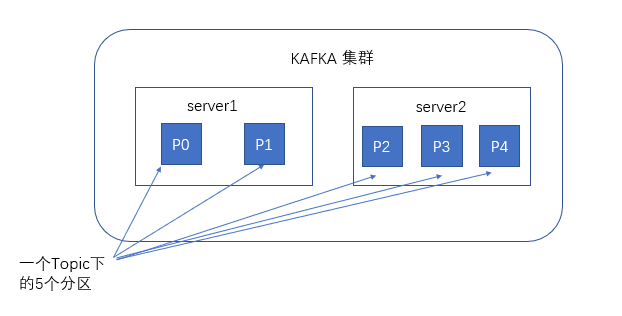
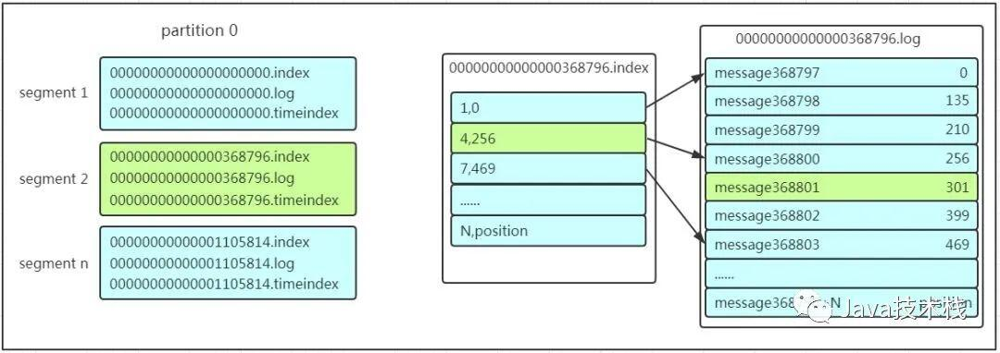

##### 特点

- 一个分布式的，支持多分区、多副本，基于 Zookeeper 的分布式消息流平台，它同时也是一款开源的基于发布订阅模式的消息引擎系统.
- 高吞吐、低延迟：kakfa 最大的特点就是收发消息非常快，kafka 每秒可以处理几十万条消息，它的最低延迟只有几毫秒。
- 高伸缩性： 每个主题(topic) 包含多个分区(partition)，主题中的分区可以分布在不同的主机(broker)中。
- 持久性、可靠性： Kafka 能够允许数据的持久化存储，消息被持久化到磁盘，并支持数据备份防止数据丢失，Kafka 底层的数据存储是基于 Zookeeper 存储的，Zookeeper 我们知道它的数据能够持久存储。
- 容错性： 允许集群中的节点失败，某个节点宕机，Kafka 集群能够正常工作
- 高并发： 支持数千个客户端同时读写

##### Kafka高性能原因

```
    顺序读写
    零拷贝
    消息压缩
    分批发送

Kafka 实现了零拷贝原理来快速移动数据，避免了内核之间的切换。Kafka 可以将数据记录分批发送，从生产者到文件系统（Kafka 主题日志）到消费者，可以端到端的查看这些批次的数据。
批处理能够进行更有效的数据压缩并减少 I/O 延迟，Kafka 采取顺序写入磁盘的方式，避免了随机磁盘寻址的浪费，更多关于磁盘寻址的了解，请参阅 程序员需要了解的硬核知识之磁盘 。
总结一下其实就是四个要点

```

##### 作用

```
消息中间件:解耦消息的生产和消费, 缓冲, 异步
```

## 组件

##### Topic

- 即主题，通过对消息指定主题可以将消息分类，消费者可以只关注自己需要的Topic中的消息

#####  partitions

-  创建一个topic时，同时可以指定分区数目, 同一个topic的数据，会被分散的存储到多个partition中，这些partition可以在同一台机器上，也可以是在多台机器上. 
-  有利于水平扩展，避免单台机器在磁盘空间和性能上的限制，同时可以通过复制来增加数据冗余性，
-  提高容灾能力
-  提高吞吐量: 以partition为读写单位，可以多个消费者同时消费数据，提高了消息的处理效率



- 生产者在向kafka集群发送消息的时候，可以通过指定分区来发送到指定的分区中. 也可以通过指定均衡策略来将消息发送到不同的分区中. 如果不指定，就会采用默认的随机均衡策略，将消息随机的存储到不同的分区中
- 单一主题中的分区有序，但是无法保证主题中所有的分区有序


- partition会实际存储在系统的摸个目录
- 为了做到均匀分布，通常partition的数量通常是Broker Server数量的整数倍.
- 分区的作用是做负载，提高kafka的吞吐量。同一个topic在不同的分区的数据是不重复的，partition的表现形式就是一个一个的文件夹

##### Leader 和 Follower

- 每个 partition 有且仅有一个作为 Leader, 可以有多个副本 Follower
  Leader是当前负责数据的读写的partition
- Follower 跟随 Leader，所有写请求都通过Leader路由，数据变更会广播给所有Follower，Follower与Leader保持数据同步
- 如果Leader失效，则从Follower中选举出一个新的Leader。当Follower与Leader挂掉、卡住或者同步太慢，leader会把这个follower从“in sync replicas”（ISR）列表中删除，重新创建一个Follower

##### Consumer Group

- 同一个topic的数据，会广播给不同的group, 同一个group中的worker，只有一个worker能拿到这个数据
- 对于一个group而言, 一个消费者可以消费多个分区，一个分区只能给一个消费者消费, 因此，若一个group中的消费者数量大于分区数量的话，多余的消费者将不会收到任何消息

Kafka实现单播和广播两种消息模型的手段。

##### Broker

```
一个独立的 Kafka 服务器就被称为 broker
broker 是集群 的组成部分, 每个集群都有一个 broker 同时充当了集群控制器的角色
```

##### Consumer Offset

```
是一个不断递增的整数值，用来记录消费者发生重平衡时的位置，以便用来恢复数据
```

##### User group

```
所有usergroup中的consumer使用一套offset
```

##### Message

```
每一条发送的消息主体
```

##### 消息队列通信的模式

- 点对点模式

- 发布订阅模式
  - 这个模式的问题: 

##### 发布订阅模式推送速度问题


- 由于是消费者被动接收推送，所以无需感知消息队列是否有待消费的消息. 但是consumer1、consumer2、consumer3由于机器性能不一样，所以处理消息的能力也会不一样，但消息队列却无法感知消费者消费的速度
  - 假设三个消费者处理速度分别是8M/s、5M/s、2M/s，如果队列推送的速度为5M/s，则consumer3无法承受. 如果队列推送的速度为2M/s，则consumer1、consumer2会出现资源的极大浪费

## 发送数据过程


##### 如何不丢数据

```
通过ACK应答机制, 在生产者向队列写入数据的时候可以设置参数来确定是否确认kafka接收到数据，这个参数可设置的值为0、1、all。

0代表producer往集群发送数据不需要等到集群的返回，不确保消息发送成功。安全性最低但是效率最高。

1代表producer往集群发送数据只要leader应答就可以发送下一条，只确保leader发送成功。

all代表producer往集群发送数据需要所有的follower都完成从leader的同步才会发送下一条，确保leader发送成功和所有的副本都完成备份。安全性最高，但是效率最低。

如果往不存在的topic写数据, kafka会自动创建topic，分区和副本的数量根据默认配置都是1
```

## 数据保存

##### 如何存储数据

kafka将数据保存在磁盘，Kafka初始会单独开辟一块磁盘空间，顺序写入数据（效率比随机写入高）

##### Partition 结构

- Partition在服务器上的表现形式就是一个一个的文件夹

- 每个partition的文件夹下面会有多组segment文件

- 每组segment文件三个文件: log文件实际是存储message, index和timeindex文件为索引文件

>partition有三组segment文件，每个log文件的大小是一样的，但是存储的message数量是不一定相等的, 每条的message大小不一致
>
>文件的命名是以该segment最小offset来命名的，如000.index存储offset为0~368795的消息，kafka就是利用分段+索引的方式来解决查找效率的问题


##### message 结构

```
1. offset：offset是一个占8byte的有序id号，它可以唯一确定每条消息在parition内的位置
2. 消息大小：消息大小占用4byte，用于描述消息的大小。
3. 消息体：消息体存放的是实际的消息数据（被压缩过），占用的空间根据具体的消
```

##### 消息删除策略

```
1. 基于时间，默认配置是168小时（7天）。
2. 基于大小，默认配置是1073741824. 
3. kafka读取特定消息的时间复杂度是O(1)，所以这里删除过期的文件并不会提高kafka的性能
```

## 消费数据

- 消费者在拉取消息的时候也是找leader去拉取
- 多个消费者可以组成一个消费者组, 每个消费者组都有一个组id, 同一个消费组者的消费者可以消费同一topic下不同分区的数据，但是不会组内多个消费者消费同一分区的数据
- 多出来的消费者不消费任何partition的数据。所以在实际的应用中，建议消费者组的consumer的数量与partition的数量一致

```
查找一个offset为368801的message是什么样的过程呢
作者：D糊涂小天才z
https://www.bilibili.com/read/cv8517619/
出处： bilibili

```

##### 查找offset为368801的message过程



```
这套机制是建立在offset为有序的基础上，利用segment+有序offset+稀疏索引+二分查找+顺序查找等多种手段来高效的查找数据

1. 利用二分法查找找到offset的368801message所在的segment文件(这里找到的就是在第二个segment文件)

2. 打开找到的segment中的.index文件（也就是368796.index文件，该文件起始偏移量为368796+1，我们要查找的offset为368801的message在该index内的偏移量为368796+5=368801，所以这里要查找的相对offset为5）。由于该文件采用的是稀疏索引的方式存储着相对offset及对应message物理偏移量的关系，所以直接找相对offset为5的索引找不到，这里同样利用二分法查找相对offset小于或者等于指定的相对offset的索引条目中最大的那个相对offset，所以找到的是相对offset为4的这个索引。

3. 根据找到的相对offset为4的索引确定message存储的物理偏移位置为256。打开数据文件，从位置为256的那个地方开始顺序扫描直到找到offset为368801的那条Message
```

##### 消费者记录各自消费的位置

```
在早期的版本中，消费者将消费到的offset维护zookeeper中，consumer每间隔一段时间上报一次，这里容易导致重复消费，且性能不好

在新的版本中消费者消费到的offset已经直接维护在kafk集群的_consumeroffsets这个topic中
```

## 与常用 message queue 都比

##### RabbitMQ

```
```

##### Redis

```
```

