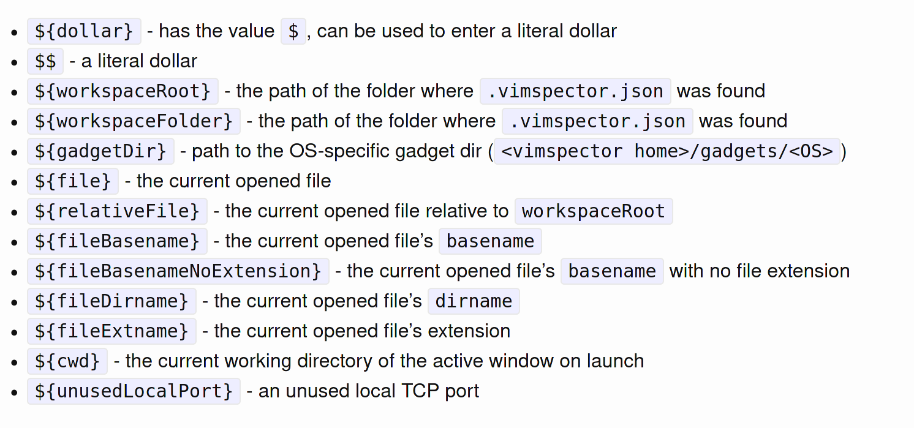

##### 参考案例

```
https://zhuanlan.zhihu.com/p/382092667
http://47.112.232.56/github/zh/61928120c295597421382002.html
https://github.com/vim-vdebug/vdebug


Tmux + vim
https://kxcblog.com/post/terminal/2.tmux-tutorial/


https://zhuanlan.zhihu.com/p/267856388
```

## 安装 - vim  

##### install

> [官网](https://www.vim.org/)
>
> [github](https://github.com/vim/vim)

```bash
# 1. 卸载编译安装的 vim
$ sudo make uninstall

# 2. 安装依赖
$ yum install python36 python36-devel ncurses-devel
$ yum remove vim

# 3. clone
$ git clone https://github.com/vim/vim.git
如果 github clone 速度慢使用国内镜像下载
$ git clone https://github.com.cnpmjs.org/vim/vim.git

# 4. 编译
$ cd vim/src
$ ./configure --with-features=huge --enable-multibyte --enable-rubyinterp=yes --enable-python3interp=yes --disable-selinux --enable-cscope --with-python3-command=python3.6 --prefix=/opt/vim
$ make clean
$ make
$ sudo make install

# 5. 软连接
$ ln -s /opt/vim/bin/vim /usr/bin/vim
```

##### 配置文件

```
Vim 的全局配置一般在/etc/vim/vimrc或者/etc/vimrc，对所有用户生效
用户个人的配置在 ~/.vimrc
```

##### 是否支持 python2 / python3

```
$ vim --version
```

## 安装 - neovim

##### install

```bash
$ wget https://github.com/neovim/neovim/releases/download/v0.6.0/nvim-linux64.tar.gz
$ tar zxvf nvim-linux64.tar.gz
$ mkdir -p /opt/neovim-0.6.0
# 移动到 opt
$ ln -s /opt/neovim-0.6.0/bin/nvim /usr/bin/nvim
```

##### 配置文件

```
~/.config/nvim/init.vim
```

##### 支持 python2 / python3

```bash
1. 查看是否支持 python
:checkhealth


2. 安装插件
$ pip install neovim
$ pip3 install neovim
```

## vim plug

> [github](https://github.com/junegunn/vim-plug)

##### install

```bash
$ sh -c 'curl -fLo "${XDG_DATA_HOME:-$HOME/.local/share}"/nvim/site/autoload/plug.vim --create-dirs https://raw.githubusercontent.com/junegunn/vim-plug/master/plug.vim'
```

##### setting

```
call plug#begin('~/.vim/plugged')

call plug#end()
```

##### 命令

| Command                             | Description                                                  |
| ----------------------------------- | ------------------------------------------------------------ |
| `PlugInstall [name ...] [#threads]` | Install plugins                                              |
| `PlugUpdate [name ...] [#threads]`  | Install or update plugins                                    |
| `PlugClean[!]`                      | Remove unlisted plugins (bang version will clean without prompt) |
| `PlugUpgrade`                       | Upgrade vim-plug itself                                      |
| `PlugStatus`                        | Check the status of plugins                                  |
| `PlugDiff`                          | Examine changes from the previous update and the pending changes |
| `PlugSnapshot[!] [output path]`     | Generate script for restoring the current snapshot of the plugins |

##### PlugInstall 安装失败

```
修改 /home/glfadd/.vim/autoload/plug.vim

1. 将
let fmt = get(g:, 'plug_url_format', 'https://git::@github.com/%s.git')
改为
let fmt = get(g:, 'plug_url_format', 'https://git::@github.com.cnpmjs.org/%s.git')


2. 将
\ '^https://git::@github\.com', 'https://github.com', '')
改为
\ '^https://git::@github.com.cnpmjs\.org', 'https://github.com.cnpmjs.org', '')
```

## coc

> [github](https://github.com/neoclide/coc.nvim)
>
> [文档](https://github.com/neoclide/coc.nvim/wiki/Language-servers)

coc.nvim 是 LSP (Language Server Protocol) 语言服务器

##### 安装

> 必须安装 nodejs >= 12.12 才能使用

```
Plug 'neoclide/coc.nvim', {'branch': 'release'}
```

##### python

> [github](https://github.com/fannheyward/coc-pyright)

- 安装 python 语言服务器

```
:CocInstall coc-pyright
```

##### 配置文件

```
保存在 /home/glfadd/.config/nvim/coc-settings.json 中

:CocConfig


https://github.com/fannheyward/coc-pyright/blob/master/package.json
https://github.com/microsoft/pyright/blob/main/docs/configuration.md
```


##### 安装问题 1

- 问题描述

  ```
  [coc.nvim] build/index.js not found, please install dependencies and compile coc.nvim by: yarn install
  ```

- 解决办法

  ```bash
  # sudo su
  $ npm install -g yarn
  $ cd /home/gong/.vim/plugged/coc.nvim
  $ yarn install
  $ yarn build
  ```

- 验证

  ```
  安装成功后再次进入 nvim 显示如下消息
  
  [coc.nvim] creating data directory: /home/gong/.config/coc
  ```

##### 


## plugin

##### font - 字体(未使用)

> [github](https://github.com/ryanoasis/nerd-fonts)

```bash
$ sudo ./install.sh
```

##### vim-airline 状态栏

> [vim-airline](https://github.com/vim-airline/vim-airline)
>
> [vim-airline-themes](https://github.com/vim-airline/vim-airline-themes)
>
> [文档](https://github.com/vim-airline/vim-airline/blob/master/doc/airline.txt)

- install

  ```
  Plug 'vim-airline/vim-airline'
  Plug 'vim-airline/vim-airline-themes'
  ```

##### fzf 模糊查询

> [github](https://github.com/junegunn/fzf.vim)

```
参考
https://www.jianshu.com/p/bb91582317ed
https://blog.zfanw.com/fzf-vim-usage/
```

- install

  ```
  Plug 'junegunn/fzf', { 'do': { -> fzf#install() } }
  Plug 'junegunn/fzf.vim'
  ```

##### dashboard-nvim 启动页面

> [github](https://github.com/glepnir/dashboard-nvim)
>
> [开始画面顶部图片](https://github.com/glepnir/dashboard-nvim/wiki/Ascii-Header-Text)

- 依赖: 3 个必须安装一个 (用 fzf)

  > [vim-clap](https://github.com/liuchengxu/vim-clap)
  >
  > [fzf.vim](https://github.com/junegunn/fzf.vim)
  >
  > [telescope.nvim](https://github.com/nvim-lua/telescope.nvim)

- install

  ```
  Plug 'glepnir/dashboard-nvim'
  ```

- setting

  ```
  let g:dashboard_default_executive ='fzf'
  ```

##### vista.vim 查看缓冲区函数, 变量，并跳转

> [github](https://github.com/liuchengxu/vista.vim)

- 依赖

  ```
  需要 vim 插件 coc.vim
  ```

- install

  ```
  Plug 'liuchengxu/vista.vim'
  ```

- setting

  ```
  
  ```

- use

  ```
  Vista
  Vista!
  Vista!!
  ```

##### defx.nvim 文件树

> [github](https://github.com/Shougo/defx.nvim)
>
> https://blog.csdn.net/Marshall001/article/details/115494459

- 依赖

  ```
  Neovim 0.4.0 or Vim8.2+
  Python3.6.1+
  coc.vim
  
  $ pip3 install --user pynvim
  ```

- install

  ```
  if has('nvim')
    Plug 'Shougo/defx.nvim', { 'do': ':UpdateRemotePlugins' }
  else
    Plug 'Shougo/defx.nvim'
    Plug 'roxma/nvim-yarp'
    Plug 'roxma/vim-hug-neovim-rpc'
  endif
  ```

- setting

  ```
  
  ```
  
- use

  ```
  
  ```

##### vim-easy-align 文本对齐

> [github](https://github.com/junegunn/vim-easy-align)
>
> https://www.shuzhiduo.com/A/qVdePZb5Pg/

- install

  ```
  Plug 'junegunn/vim-easy-align'
  ```

- setting

  ```
  
  ```

##### nerdcommenter 代码注释

> [github](https://github.com/preservim/nerdcommenter)

- install

  ```
  Plug 'preservim/nerdcommenter'
  ```

- setting

  ```
  " 注释和文字中间额外增加 1 个空格
  let g:NERDSpaceDelims = 1
  
  " 将行注释符左对齐, 不是按照代码缩进注释
  let g:NERDDefaultAlign = 'left'
  
  " 注释对末尾空白符修剪
  let g:NERDTrimTrailingWhitespace = 1
  ```

- use

  ```
  <leader>cc   加注释
  <leader>cu   解开注释
  <leader>c<space>  加上/解开注释, 智能判断
  <leader>cy   先复制, 再注解(p可以进行黏贴)
  ```

##### bufexplorer 列表切换 buffer

> [github](https://github.com/jlanzarotta/bufexplorer)

- install

  ```
  Plug 'jlanzarotta/bufexplorer'
  ```

- setting

  ```
  <Leader>be 普通打开
  <Leader>bt 切换打开/关闭
  <Leader>bs 强制水平拆分打开
  <Leader>bv 强制垂直劈开
  ```

##### vim-autoformat 代码格式化

> [github](https://github.com/vim-autoformat/vim-autoformat)

- install

  ```
  Plug 'Chiel92/vim-autoformat'
  ```

- setting

  - python 支持

    ```
    pip install autopep8
    ```

  - java 支持

    ```
    ```

  - 其他设置

    ```
    nnoremap <F6> :Autoformat<CR>
    let g:autoformat_autoindent = 0
    let g:autoformat_retab = 0
    let g:autoformat_remove_trailing_spaces = 0
    ```

- use

  ```
  :Autoformat
  ```

##### ale 语法检测

> [github](https://github.com/dense-analysis/ale)

- install

  ```
  Plug 'dense-analysis/ale'
  ```

- setting

  - python 支持

    ```
    pip install flake8
    ```

##### vim-translator 词典

> [github](https://github.com/voldikss/vim-translator)

- install

  ```
  Plug 'voldikss/vim-translator'
  ```

- setting

  ```
  
  ```
  

##### asyncrun.vim 运行代码

> https://github.com/skywind3000/asyncrun.vim [文档](https://github.com/skywind3000/asyncrun.vim/blob/master/README-cn.md)
>
> https://github.com/skywind3000/asynctasks.vim [文档](https://github.com/skywind3000/asynctasks.vim/blob/master/README-cn.md)
>

- install

  ```
  Plug 'skywind3000/asyncrun.vim'
  " asyncrun 任务管理插件
  Plug 'skywind3000/asynctasks.vim'
  ```

- setting

  ```
  " asyncrun 运行时自动打开高度为 6 的 quickfix 窗口, 不然你看不到任何输出                 
  let g:asyncrun_open = 10    
  ```

- use

  ```
  运行 python
  :AsyncRun -cwd=$(VIM_FILEDIR) python "$(VIM_FILEPATH)"
  
  :AsyncRun python code_test.py
  ```

##### vim-fugitive git工具

> [github](https://github.com/tpope/vim-fugitive)

- install

  ```
  Plug 'tpope/vim-fugitive'
  ```
  
- use

  ```
  :Git status
  :Git diff
  ```

##### 配色

```

```

##### shell补全

```
https://github.com/Shougo/neocomplete.vim


command mode
```

##### markdown

```
https://github.com/plasticboy/vim-markdown

https://zhuanlan.zhihu.com/p/84773275
```

##### vim-floaterm 内置终端

```
https://blog.csdn.net/weixin_39795268/article/details/111344410
```

> [github](https://github.com/voldikss/vim-floaterm)
>
> [文档](https://github.com/voldikss/vim-floaterm/blob/master/doc/floaterm.txt)

- install

  ```
  Plug 'voldikss/vim-floaterm'
  ```

- setting

  ```
  - g:floaterm_keymap_new 打开
  - g:floaterm_keymap_prev
  - g:floaterm_keymap_next
  - g:floaterm_keymap_first
  - g:floaterm_keymap_last
  - g:floaterm_keymap_hide
  - g:floaterm_keymap_show
  - g:floaterm_keymap_kill
  - g:floaterm_keymap_toggle 隐藏/重新打开该窗口
  ```

- use

  ```
  
  ```

#####  undotree

> [github](https://github.com/mbbill/undotree)

- install

  ```
  Plug 'mbbill/undotree'
  ```

- setting

  ```
  ```

- use

  ```
  ```

  

## 断点调试

> [github](https://github.com/puremourning/vimspector)
>
> https://www.5axxw.com/wiki/content/jifl0q
>

##### install

```
Plug 'puremourning/vimspector'
```

##### 安装语言支持

```bash
$ cd /home/glfadd/.vim/plugged/vimspector
$ ./install_gadget.py --help
$ ./install_gadget.py --enable-python

# 会自动生成 /home/glfadd/.vim/plugged/vimspector/gadgets/linux/.gadgets.json
# ${gadgetDir} 代表着存放.gadgets.json的目录
```

##### 快捷键设置

```
# vimspector预设了vscode mode和human mode两套键盘映射

let g:vimspector_enable_mappings = 'HUMAN'
或
let g:vimspector_enable_mappings = 'VISUAL_STUDIO'
```

##### 示例代码

```
/home/glfadd/.vim/plugged/vimspector/support/test
```

##### configurations 优先级

```
1. vimspector 先在当前目录向父目录递归搜索, 如果查找到了 .vimspector.json, 则使用其中的配置，并将其所在的目录设定为项目根目录

2. 如果未查找到，在 vimspector 安装目录 ./configurations/<os>/<filetype>/*.json 的配置文件, 将打开的文件的目录设置为项目根目录。
	/home/glfadd/.vim/plugged/vimspector/configurations/linux/_all/python.json
```

##### .vimspector.json 文件参数

| 参数           | 说明                                                        | 是否必填 |
| -------------- | :---------------------------------------------------------- | -------- |
| adapters       | 调试适配器配置，如果不是进行远程调试，一般不需要设置        |          |
| configurations | 配置字段字典                                                |          |
| adapter        | 使用的调试配置器名称                                        | 是       |
| variables      | 用户定义的变量                                              |          |
| configuration  | 配置名字                                                    | 是       |
| remote-request | 远程调试使用                                                |          |
| remote-cmdLine | 远程调试使用                                                |          |
| request        | 调试的类型，lauch或attach                                   |          |
| type           | cppdgb(GDB/LLDB)或cppvsdbg(Visutal Studio Windows debugger) |          |

##### 自定义变量

```
可以在variable中定义变量。

    {
      "configurations": {
        "some-configuration": {
          "variables": {
            "gdbserver-version": {
              "shell": [ "/path/to/my/scripts/get-gdbserver-version" ],
              "env": {
                "SOME_ENV_VAR": "Value used when running above command"
              }
            },
            "some-other-variable": "some value"
          }
        }
      }
    }

其中gdbserver-version和some-other-variable都是用户定义的变量，可以像预定义变量一样使用。

可以调用外部命令，将外部命令的输出赋给变量。gdbserver-version的值就是/path/to/my/scripts/get-gdbserver-version的输出。

还可以在运行vimspector时输入变量的值。最典型的运例子是程序参数的传递，vimspector调试的程序的参数以数组的形式传递，在配置文件中将args设置为一个在运行时用户输入的变量，就可以模拟命令行的效果。

用户输入值的变量用"*${variable-neme}表示，比如以下配置：

      "args": [ "*${CommandLineArgs}" ]

在运行时vimspector会要求用户输入值，如果用户输入1、2、3,args就会被拓展成["1", "2", "3"]传递给程序。

```

##### 预定义变量



##### use

>  在每个项目目录中创建 .vimspector.json 用来设置调试的参数

- python

  ```json
  {
    "configurations": {
      "run": {
        "adapter": "debugpy",
        "default": true,
        "configuration": {
          "request": "launch",
          "program": "${workspaceRoot}/${file}",
          "cwd": "${workspaceRoot}",
          "stopOnEntry": true
        },
        "breakpoints": {
          "exception": {
            "raised": "N",
            "uncaught": "",
            "userUnhandled": ""
          }
        }
      }
    }
  }
  ```

##### 自定义按键

```
nmap <F5> <Plug>VimspectorContinue
```

##### HUMAN

| Key          | Function                     | API                                                          |
| ------------ | ---------------------------- | ------------------------------------------------------------ |
| `F5`         | 调试时，继续。否则启动调试。 | `vimspector#Continue()`                                      |
| `F3`         | Stop debugging.              | `vimspector#Stop()`                                          |
| `F4`         | 使用相同的配置重新启动调试。 | `vimspector#Restart()`                                       |
| `F6`         | Pause debugee.               | `vimspector#Pause()`                                         |
| `F9`         | 切换当前行上的行断点。       | `vimspector#ToggleBreakpoint()`                              |
| `<leader>F9` | 切换当前行上的条件行断点。   | `vimspector#ToggleBreakpoint( { trigger expr, hit count expr } )` |
| `F8`         | 为游标下的表达式添加函数断点 | `vimspector#AddFunctionBreakpoint( '<cexpr>' )`              |
| `F10`        | Step Over                    | `vimspector#StepOver()`                                      |
| `F11`        | Step Into                    | `vimspector#StepInto()`                                      |
| `F12`        | 跳出当前功能范围             | `vimspector#StepOut()`                                       |

##### VISUAL_STUDIO

| Key             | Function                     | API                                             |
| --------------- | ---------------------------- | ----------------------------------------------- |
| `F5`            | 调试时，继续。否则启动调试。 | `vimspector#Continue()`                         |
| `Shift F5`      | Stop debugging.              | `vimspector#Stop()`                             |
| `Ctrl Shift F5` | 使用相同的配置重新启动调试。 | `vimspector#Restart()`                          |
| `F6`            | Pause debugee.               | `vimspector#Pause()`                            |
| `F9`            | 切换当前行上的行断点。       | `vimspector#ToggleBreakpoint()`                 |
| `Shift F9`      | 为游标下的表达式添加函数断点 | `vimspector#AddFunctionBreakpoint( '<cexpr>' )` |
| `F10`           | Step Over                    | `vimspector#StepOver()`                         |
| `F11`           | Step Into                    | `vimspector#StepInto()`                         |
| `Shift F11`     | 跳出当前功能范围             | `vimspector#StepOut()`                          |

## pip

##### 性能测试

```
pip install line_profiler
```

## config - neovim

```
let mapleader=','

set number
set relativenumber  " 行都为相对于该行的相对行号
set encoding=utf-8
set showmatch       " 括号匹配
set tabstop=4       " 设置Tab长度为4空格
set shiftwidth=4    " 设置自动缩进长度为4空格
set autoindent      " 继承前一行的缩进方式，适用于多行注释
set nocompatible    " 关闭与vi的兼容模式
set nowrap          " 不自动折行
set ignorecase      " 忽略大小写
set cursorline      " 高亮行
set cc=100          " 尺寸线
set t_Co=256        " 开启256色支持
set background=dark " 背景使用黑色, 只有 light 和 dark

nnoremap <C-J> <C-W><C-J> " 移动窗口快捷键
nnoremap <C-K> <C-W><C-K>
nnoremap <C-L> <C-W><C-L>
nnoremap <C-H> <C-W><C-H>

noremap <Tab> :bn<CR> " buffer 切换
noremap <S-Tab> :bp<CR>
noremap <Leader><Tab> :Bw<CR>
noremap <Leader><S-Tab> :Bw!<CR>
noremap <C-t> :tabnew split<CR>

" 设置高亮的颜色
"highlight CursorLine   cterm=NONE ctermbg=gray ctermfg=green guibg=NONE guifg=NONE
"highlight CursorColumn cterm=NONE ctermbg=gray ctermfg=green guibg=NONE guifg=NONE


call plug#begin('~/.vim/plugged')
Plug 'vim-airline/vim-airline'                                    " 状态栏
Plug 'vim-airline/vim-airline-themes'
Plug 'junegunn/fzf', { 'dir': '~/.fzf', 'do': './install --all' } " 模糊查询
Plug 'junegunn/fzf.vim' 
Plug 'glepnir/dashboard-nvim'                                     " 启动页面(依赖fzf)
Plug 'neoclide/coc.nvim', {'branch': 'release'}                   " 代码补全
if has('nvim')                                                    " 文件树
  Plug 'Shougo/defx.nvim', { 'do': ':UpdateRemotePlugins' }
else
  Plug 'Shougo/defx.nvim'
  Plug 'roxma/nvim-yarp'
  Plug 'roxma/vim-hug-neovim-rpc'
endif
Plug 'preservim/nerdcommenter'                                    " 代码注释
Plug 'junegunn/vim-easy-align'                                    " 文本对齐
Plug 'jlanzarotta/bufexplorer'                                    " buffer 切换(在页面中切换)
Plug 'voldikss/vim-floaterm'                                      " 窗口内悬浮终端
Plug 'tpope/vim-fugitive'                                         " git
Plug 'skywind3000/asynctasks.vim'                                 " 后台异步执行外部命令
Plug 'skywind3000/asyncrun.vim'
Plug 'mbbill/undotree' " 撤销树

"Plug 'Chiel92/vim-autoformat' " 代码格式化
"Plug 'dense-analysis/ale' " 语法检测
"Plug 'puremourning/vimspector' " 代码 debug
"Plug 'liuchengxu/vista.vim' " 查看缓冲区函数, 变量，并跳转
call plug#end()

nnoremap <Leader>t :UndotreeToggle<CR>

" ************************************* Shougo/defx.nvim
call defx#custom#option('_', {
      \ 'winwidth': 30,
      \ 'split': 'vertical',
      \ 'direction': 'topleft',
      \ 'show_ignored_files': 0,
      \ 'buffer_name': '',
      \ 'toggle': 1,
      \ 'resume': 1
      \ })

nmap <silent> <Leader>e :Defx <cr>


" ************************************* glepnir/dashboard-nvim
let g:dashboard_default_executive ='fzf' " 这里使用 fzf
nmap <Leader>ss :<C-u>SessionSave<CR>
nmap <Leader>sl :<C-u>SessionLoad<CR>
nnoremap <silent> <Leader>dh :DashboardFindHistory<CR>
nnoremap <silent> <Leader>df :DashboardFindFile<CR>
nnoremap <silent> <Leader>dc :DashboardChangeColorscheme<CR>
nnoremap <silent> <Leader>da :DashboardFindWord<CR>
nnoremap <silent> <Leader>db :DashboardJumpMark<CR>
nnoremap <silent> <Leader>dn :DashboardNewFile<CR>

" 按键说明
let g:dashboard_custom_shortcut={
  \ 'last_session'       : 'SPC d l',
  \ 'find_history'       : 'SPC d h',
  \ 'find_file'          : 'SPC d f',
  \ 'new_file'           : 'SPC d n',
  \ 'change_colorscheme' : 'SPC d c',
  \ 'find_word'          : 'SPC d a',
  \ 'book_marks'         : 'SPC d b',
  \ }

" 设置按键前面的图表, 必须先定义一个变量, 否则报错
let g:dashboard_custom_shortcut_icon = {}
let g:dashboard_custom_shortcut_icon['last_session'] = ''
let g:dashboard_custom_shortcut_icon['find_history'] = ''
let g:dashboard_custom_shortcut_icon['find_file'] = ''
let g:dashboard_custom_shortcut_icon['new_file'] = ''
let g:dashboard_custom_shortcut_icon['change_colorscheme'] = ''
let g:dashboard_custom_shortcut_icon['find_word'] = ''
let g:dashboard_custom_shortcut_icon['book_marks'] = ''

" 开始的图形
let g:dashboard_custom_header = [
   \' ███████████████████████████ ',
   \' ███████▀▀▀░░░░░░░▀▀▀███████ ',
   \' ████▀░░░░░░░░░░░░░░░░░▀████ ',
   \' ███│░░░░░░░░░░░░░░░░░░░│███ ',
   \' ██▌│░░░░░░░░░░░░░░░░░░░│▐██ ',
   \' ██░└┐░░░░░░░░░░░░░░░░░┌┘░██ ',
   \' ██░░└┐░░░░░░░░░░░░░░░┌┘░░██ ',
   \' ██░░┌┘▄▄▄▄▄░░░░░▄▄▄▄▄└┐░░██ ',
   \' ██▌░│██████▌░░░▐██████│░▐██ ',
   \' ███░│▐███▀▀░░▄░░▀▀███▌│░███ ',
   \' ██▀─┘░░░░░░░▐█▌░░░░░░░└─▀██ ',
   \' ██▄░░░▄▄▄▓░░▀█▀░░▓▄▄▄░░░▄██ ',
   \' ████▄─┘██▌░░░░░░░▐██└─▄████ ',
   \' █████░░▐█─┬┬┬┬┬┬┬─█▌░░█████ ',
   \' ████▌░░░▀┬┼┼┼┼┼┼┼┬▀░░░▐████ ',
   \' █████▄░░░└┴┴┴┴┴┴┴┘░░░▄█████ ',
   \' ███████▄░░░░░░░░░░░▄███████ ',
   \' ██████████▄▄▄▄▄▄▄██████████ ',
   \ ]


" ************************************* vim-airline/vim-airline
let g:airline#extensions#tabline#enabled = 1        " 开启tabline
let g:airline#extensions#tabline#buffer_nr_show = 1 " 显示buffer编号
let g:bufferline_modified = '+'                     " 缓冲区已修改的符号
let g:airline_theme='silver'

nmap <leader>1 <Plug>AirlineSelectTab1
nmap <leader>2 <Plug>AirlineSelectTab2
nmap <leader>3 <Plug>AirlineSelectTab3
nmap <leader>4 <Plug>AirlineSelectTab3
nmap <leader>5 <Plug>AirlineSelectTab3
nmap <leader>6 <Plug>AirlineSelectTab3
nmap <leader>7 <Plug>AirlineSelectTab3
nmap <leader>8 <Plug>AirlineSelectTab3
nmap <leader>9 <Plug>AirlineSelectTab3
nmap <leader>0 <Plug>AirlineSelectTab3


" ************************************* preservim/nerdcommenter

let g:NERDSpaceDelims = 1 " 注释后面增加 1 个空格
let g:NERDDefaultAlign = 'left'
let g:NERDTrimTrailingWhitespace = 1


" ************************************* junegunn/vim-easy-align
xmap ga <Plug>(EasyAlign)
nmap ga <Plug>(EasyAlign)


" ************************************* jlanzarotta/bufexplorer
let g:bufExplorerDefaultHelp=0      " 不显示默认帮助信息
let g:bufExplorerShowRelativePath=0 " 显示绝对路径

let g:bufExplorerSortBy='mru'       " Sort by most recently used.
let g:bufExplorerSplitRight=0       " Split left.
let g:bufExplorerSplitVertical=1    " Split vertically.
let g:bufExplorerSplitVertSize = 30 " Split width
let g:bufExplorerUseCurrentWindow=1 " Open in new window.
let g:buffet_use_devicons = 10


" ************************************* Chiel92/vim-autoforma
nnoremap <Leader>a :Autoformat<CR>


" ************************************* skywind3000/asyncrun.vim
let g:asyncrun_open = 10 " 设置输出窗口高度, 不然看不到任何输出
let g:vimspector_enable_mappings = 'HUMAN'
nmap <LocalLeader><F11> <Plug>VimspectorRestart
nmap <F7> <Plug>VimspectorRestart


" ************************************* liuchengxu/vista.vim
let g:vista_default_executive = 'coc' " 使用 coc


" ************************************* voldikss/vim-floaterm
let g:floaterm_keymap_new = '<Leader>ft'
let g:floaterm_keymap_toggle = '<Leader>fh'
let g:floaterm_keymap_prev = '<Leader>fp'
let g:floaterm_keymap_next = '<Leader>fn'
let g:floaterm_keymap_kill = '<Leader>fc'

let g:floaterm_width=0.8
let g:floaterm_height=0.8
let g:floaterm_position = 'center'


```


