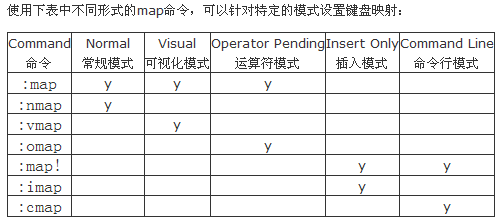

##### 启动是分屏幕

```bash
1. 垂直分
$ vim -On file1 file2 file3 ...

2. 水平
$ vim -on file1 file2 file3 ...
```

##### 分屏

```bash
1. 上下分割当前打开的文件
Ctrl+w s

2. 上下分割, 并打开一个新的文件
:sp filename

3. 左右分割当前打开的文件
Ctrl+w v

4. 左右分割，并打开一个新的文件
:vsp filename
```

##### 移动光标

```
Ctrl+w l
Ctrl+w h
Ctrl+w k
Ctrl+w j

把光标移到下一个的屏中
Ctrl+w w
```

##### 移动分屏

```
Ctrl+w L
Ctrl+w H
Ctrl+w K
Ctrl+w J
```

##### 调整高度

```
1. 让所有的屏都有一样的高度。
Ctrl+W =

2. 增加高度
Ctrl+W +

3. 减少高度
Ctrl+W -
```

##### 关闭

```
Ctrl+w c

如果只剩最后 1 个则退出 Vim
Ctrl+w q
```

## 键盘映射

##### 查看键盘映射

```
:h key-notation
```


| Command 命令 | Normal  常规模式 | Visual 可视化模式 | Operator Pending 运算符模式 | Insert Only 插入模式 | Command Line 命令行模式 |
| ------------ | ---------------- | ----------------- | --------------------------- | -------------------- | ----------------------- |
| `:map`       | y                | y                 | y                           |                      |                         |
| `:nmap`      | y                |                   |                             |                      |                         |
| `:vmap`      |                  | y                 |                             |                      |                         |
| `:omap`      |                  |                   | y                           |                      |                         |
| `:map!`      |                  |                   |                             | y                    | y                       |
| `:imap`      |                  |                   |                             | y                    |                         |
| `:cmap`      |                  |                   |                             |                      | y                       |



```
remap
noremap
nnoremap
vnoremap


<CR> 相当于命令最后按回车键
<Return> 相当于 <CR>
<Enter> 相当于 <CR>
```

##### 键表

```
<k0> - <k9> 小键盘 0 到 9 *keypad-0* *keypad-9* 
<S-...> Shift＋键 *shift* *<S-* 
<C-...> Control＋键 *control* *ctrl* *<C-* 
<M-...> Alt＋键 或 meta＋键 *meta* *alt* *<M-* 
<A-...> 同 <m-...> *<A-* 
<t_xx> termcap 里的 "xx" 入口键
<Esc>

<D> Command
Alt 可以是 <M-key>或<A-key>


```

##### 特殊参数

```
<buffer> 
<silent> 
<special> 
<script> 
<expr> 
<unique> 
```


```
连续按


```

