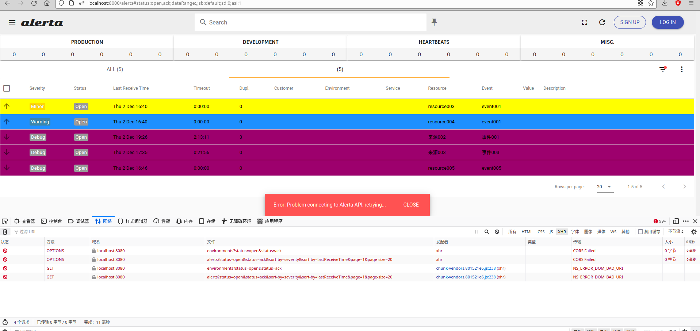

## document

> 安装依赖 MongoDB
>
> [官网](https://alerta.io/)
>
> [github - Alerta monitoring system](https://github.com/alerta/alerta)
>
> [github - Alerta Web UI](https://github.com/alerta/alerta-webui)
>
> [github - Prometheus config for Alerta](https://github.com/alerta/prometheus-config)
>
> [github - Contributed integrations, plugins and custom webhooks](https://github.com/alerta/alerta-contrib)
>
> [文档 - home](https://docs.alerta.io/)
>
> [文档 - 客户端](https://github.com/alerta/python-alerta-client)
>
> [文档  - 发送消息](https://docs.alerta.io/cli.html#cli-send)
>
> [文档 - 配置文件setting]( https://docs.alerta.io/configuration.html?highlight=email)
>
> [文档 - pdf](https://buildmedia.readthedocs.org/media/pdf/alerta/latest/alerta.pdf)

说明

> Alerta monitoring system 和 Alerta Web UI 是单独的两个服务
>
> Alerta monitoring system 提供服务接口, 端口 8080. 
>
> Alerta Web UI 提供页面, 端口 8000. 
>
> 命令 python3 -m http.server 8000 提供一个可以访问文件的服务, 并指定一个接口
>
> 

## alerta monitoring system

> [v8.6.4](https://github.com/alerta/alerta/releases/tag/v8.6.4)
>
> 需要安装 MongoDB

##### installation

```
$ git clone https://github.com/alerta/alerta.git
$ pip install -r requirements.txt
$ pip install python-dotenv
```

##### psycopg2 包安装失败

```
需要安装环境依赖
$ aptitude install libpq-dev python-dev
```

##### run

```bash
$ python wsgi.py
```

## alerta Web UI

> [v8.6.1](https://github.com/alerta/alerta-webui/releases/tag/v8.6.1)
>
> http.server 需要在 dist 目录下
>
> Alerta Web UI 会调用 Alerta monitoring system

##### installation

```bash
# 将项目下载到 Alerta monitoring system 的目录下

$ wget https://github.com/alerta/alerta-webui/releases/latest/download/alerta-webui.tar.gz
$ tar zxvf alerta-webui.tar.gz
$ cd dist
$ python3 -m http.server 8000
```

##### web ui

```
http://localhost:8000
```

## alerta contrib

```


```


## prometheus config

```

```


## alerta monitoring system settings

> 文件位置: ./alerta/settings.py

##### 查看当前配置

```bash
$ alerta config
```


```
[DEFAULT]
timezone = Australia/Sydney
output = json

[profile development]
endpoint = https://localhost:8443
key = demo-key
sslverify = off
timeout = 10.0
debug = yes
```

 


