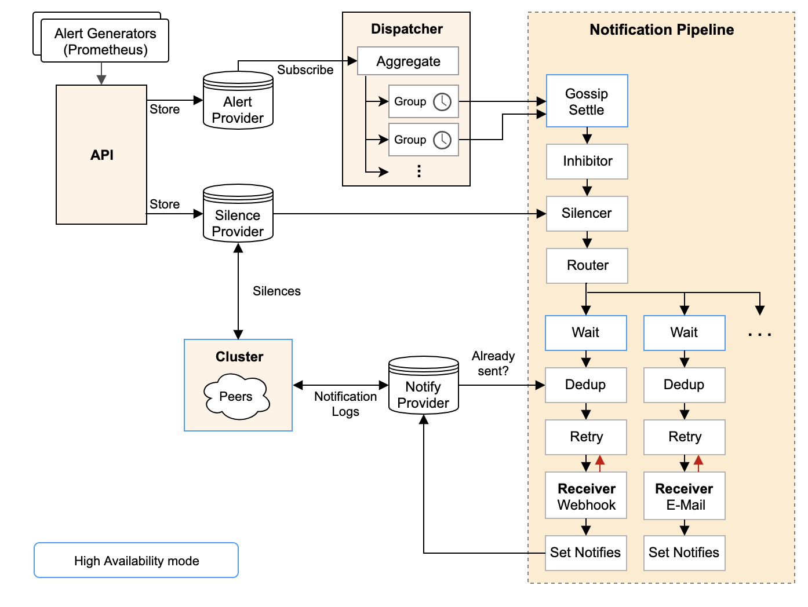

##### 参考

```
*****
https://www.cnblogs.com/xiaobaozi-95/p/10740511.html
*****

https://zhuanlan.zhihu.com/p/179292686
https://www.cnblogs.com/longcnblogs/p/9620733.html
https://zhuanlan.zhihu.com/p/179294441
https://zhuanlan.zhihu.com/p/179292686
https://zhuanlan.zhihu.com/p/74932366
https://www.cnblogs.com/zhaojiedi1992/p/zhaojiedi_liunx_65_prometheus_alertmanager.html
https://yunlzheng.gitbook.io/prometheus-book/parti-prometheus-ji-chu/alert/prometheus-alert-manager-overview


详细
https://www.cnblogs.com/battlescars/p/prometheus_alertmanager.html
```
##### 是什么

```
Prometheus监控系统中，采集与警报是分离的。警报规则在 Prometheus 定义，警报规则触发以后，才会将信息转发到给独立的组件 Alertmanager ，经过 Alertmanager 对警报的信息处理后，最终通过接收器发送给指定用户
```

##### 架构



```
从左上开始，Prometheus 发送的警报到 Alertmanager;
警报会被存储到 AlertProvider 中，Alertmanager 的内置实现就是包了一个 map，也就是存放在本机内存中，这里可以很容易地扩展其它 Provider;
Dispatcher 是一个单独的 goroutine，它会不断到 AlertProvider 拉新的警报，并且根据 YAML 配置的 Routing Tree 将警报路由到一个分组中;
分组会定时进行 flush (间隔为配置参数中的 group_interval), flush 后这组警报会走一个 Notification Pipeline 链式处理;
Notification Pipeline 为这组警报确定发送目标，并执行抑制逻辑，静默逻辑，去重逻辑，发送与重试逻辑，实现警报的最终投递;
```

##### 特性

```
1. 分组
分组机制可以将详细的告警信息合并成一个通知. 
例如，比如由于系统宕机导致大量的告警被同时触发，在这种情况下分组机制可以将这些被触发的告警合并为一个告警通知，避免一次性接受大量的告警通知

2. 抑制
当某一告警发出后，可以停止重复发送由此告警引发的其它告警的机制

3. 静默
如果接收到的告警符合静默的配置，Alertmanager则不会发送告警通知
```

##### alertmanager 的 webhook 功能

```
在prometheus监控中时常会用到alertmanager软件进行告警信息发送，常见的可以使用邮件或对接企业微信等应用实现提示信息的推送。在某些特殊情况下alertmanager无法对接生产环境中的已存在的api，需要自定一个中间层连接alertmanager和用户的应用实现特定数据的推送。

通过使用alertmanager软件的webhook功能把信息推送到python编写的api中，然后把接收到的数据进行清理筛选出有用的数据，按照其他api的数据格式重新整理数据格式并推送给指定的api
```

##### 安装

```
github
https://github.com/prometheus/alertmanager/releases

$ wget https://github.com/prometheus/alertmanager/releases/download/v0.22.2/alertmanager-0.22.2.linux-amd64.tar.gz
```

##### 运行

```bash
./alertmanager --version

# 检测配置文件是否正确
$ ./amtool check-config alertmanager.yml

# 启动
$ ./alertmanager --config.file=alertmanager.yml
$ /opt/alertmanager-0.22.2.linux-amd64/alertmanager --config.file=/opt/alertmanager-0.22.2.linux-amd64/alertmanager.yml


(未使用)
$ ./alertmanager --web.listen-address=":9093" --cluster.listen-address="0.0.0.0:9094"
```

##### alertmanager_conf.conf

```
[program:alertmanager]
directory=/opt/alertmanager-0.22.2.linux-amd64
command=/opt/alertmanager-0.22.2.linux-amd64/alertmanager --config.file=/opt/alertmanager-0.22.2.linux-amd64/alertmanager.yml
autostart=false
autorestart=false
user=glfadd
log_stdout=true
log_stderr=true
redirect_stderr = true
stdout_logfile_maxbytes = 20MB
stdout_logfile_backups = 20     
stdout_logfile = /opt/logs/supervisord_alertmanager.log
```

##### web UI

```
http://localhost:9093

prometheus 查看配置
http://localhost:9090/alerts
```

##### alert status

```
1. 结合 rule 文件的 for 参数设置的时间判断状态

pending 或 firing 的告警，Prometheus也会将它们存储到时间序列ALERTS{}中

可以通过表达式，查询告警实例：
ALERTS{alertname="<alert name>", alertstate="pending|firing", <additional alert labels>}

样本值为1表示当前告警处于活动状态（pending或者firing），当告警从活动状态转换为非活动状态时，样本值则为0。
```


| 状态     | 说明                                                         |
| -------- | ------------------------------------------------------------ |
| inactive | 未达到告警的条件                                             |
| pending  | 达到了告警的条件，但是持续时间小于设定的阈值时间（取决于有没有for语句，如果没有将直接从inactive跳到firing状态） |
| firing   | 达到了告警的条件，且持续时间大于设定的时间阈值               |


##### 发送报警的规则

```
1. 如果一条报警的状态是 FIRING 这个报警会一直发送
2. 


```

## 配置

##### alertmanager 设置 webhook 

| 参数                | 说明                                                         |
| ------------------- | ------------------------------------------------------------ |
| scrape_interval     | Promethues抓取数据的间隔，默认为1分钟                        |
| evaluation_interval | 评估间隔，Promethues跑一遍所有的定义好的alerting rules，并更新alerting的状态 |
|                     |                                                              |
| global              | 全局配置                                                     |
| templates           | 模板                                                         |
| route               | 告警路由. 根据标签匹配，确定当前告警应该如何处理             |
| receivers           | 接收方                                                       |
| inhibit_rules       | 抑制规则. 合理设置抑制规则可以减少垃圾告警的产生             |
|                     |                                                              |
| group_by            | 告警组名, 可以将多个分组的合并在一起                         |
| group_wait          | 等待该时间，目的是将该时间段内所有的属于同一个组的alert打包一起发送告警通知 |
| group_interval      | 下一次评估过程中，同一个组的alert生效，则会等待该时长发送告警通知，此时不会等待group_wait设置的时间 |
| repeat_interval     | 重复告警周期时间                                             |
| receiver            | 信息推送给谁，此处设置的值必须在receivers中能够找到          |

- alertmanager.yml

  ```yml
  global:
    resolve_timeout: 5m
  route:
    group_by:
      - test_1
    group_wait: 10s
    group_interval: 20s
    repeat_interval: 20s
    receiver: webhook
  receivers:
    - name: webhook
      webhook_configs:
        - url: 'http://localhost:11469/alertmanager'
  ```

##### prometheus.yml

```yml
global:
  scrape_interval: 15s
  evaluation_interval: 15s
  
# 配置alertmanager
alerting:
  alertmanagers:
    - static_configs:
        - targets:
            - '127.0.0.1:9093'
# 告警规则文件
rule_files:
  - rules/*.yml
  
scrape_configs:
  ...
```

##### 自定义 rules yml

| 参数                | 说明                                                         |
| ------------------- | ------------------------------------------------------------ |
| group               | 将一组相关的规则设置定义在一个group下. 每一个group中我们可以定义多个告警规则(rule) |
| alert               | 告警规则的名称                                               |
| expr                | 基于PromQL表达式告警触发条件，用于计算是否有时间序列满足该条件 |
| for                 | 评估等待时间，可选参数。用于表示只有当触发条件持续一段时间后才发送告警。在等待期间新产生告警的状态为pending。 |
| labels              | 自定义标签，允许用户指定要附加到告警上的一组附加标签         |
| annotations         | 附加描述信息                                                 |
| summary             | 告警的概要信息                                               |
| description         | 告警的详细信息                                               |
|                     |                                                              |
| $labels.<labelname> | 访问当前告警实例中指定标签的值                               |
| $value              | 获取当前PromQL表达式计算的样本值                             |

- test.yml

```yml
groups:
  - name: example
    rules:
      - alert: InstanceDown
        expr: up == 0
        for: 5m
        labels:
          severity: page
        annotations:
          summary: 'Instance {{ $labels.instance }} down'
          description: >-
            {{ $labels.instance }} of job {{ $labels.job }} has been down for
            more than 5 minutes.
      - alert: APIHighRequestLatency
        expr: 'api_http_request_latencies_second{quantile="0.5"} > 1'
        for: 10m
        annotations:
          summary: 'High request latency on {{ $labels.instance }}'
          description: >-
            {{ $labels.instance }} has a median request latency above 1s
            (current value: {{ $value }}s)
```


```
groups:
  - name: blackbox_network_stats
    rules:
      - alert: blackbox_network_stats
        expr: probe_success == 0
        for: 1m
        labels:
          severity: critical
        annotations:
          summary: '接口/主机/端口 {{ $labels.instance }}  无法联通'
          description: 请尽快检测

```


##### 支持报警类型

```
shell
command
脚本
发送 post 请求
```

##### 

## 问题

##### 报警 webhook 没有收到

```


```

##### python webhook

```
https://cloud.tencent.com/developer/article/1782471
```

